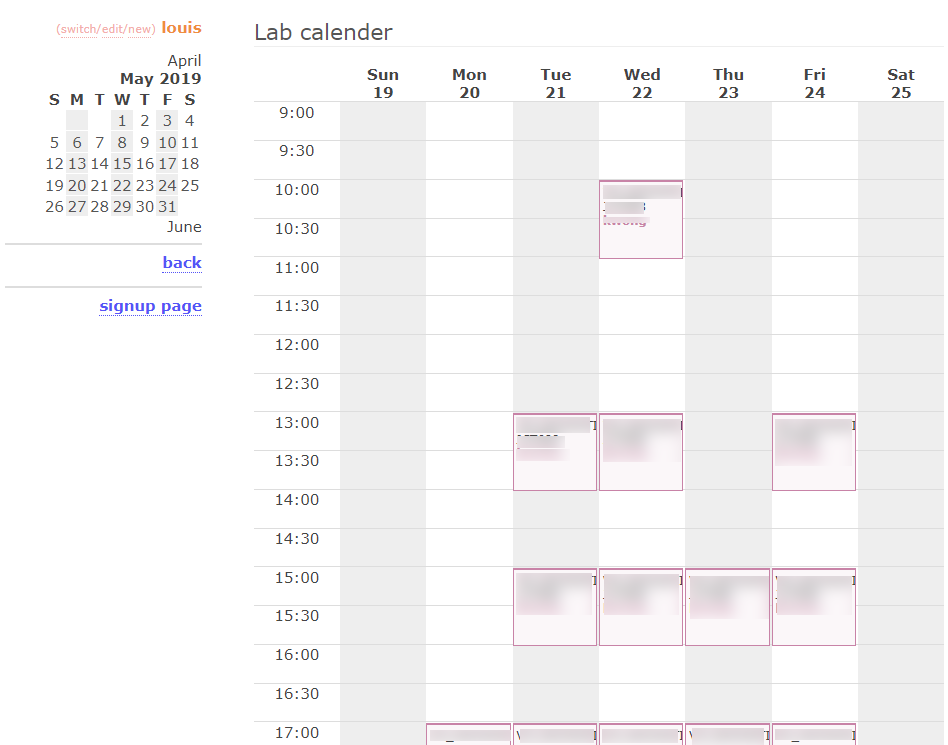

# Participant recruitment and appointment website

Visual attention research frequently involves recruiting research participants to come to the lab for one or half an hour experiment sessions. The standard way of participant recruitment is to stick posters around the campus every time you run a new experiment. Then, participants call you and make appointments. This can be tedious.

During my post-doc, I developed a website in [PHP](https://www.php.net/) and [SQLite](https://www.sqlite.org/index.html) to handle participant recruitment and appointment. Very soon, this website was known by my nearby labs. I then called it the <ins>[participant website for the vision laboratories](http://cha.psy.hku.hk/participate/)</ins> at HKU. It was in use until COVID-19, which stopped face-to-face experiments.

You can see the website and screenshots of the experimenter's view below. With the participant website, we only need to recruit participants once yearly (instead of once every experiment). The student participants will register an account on our online system and input their emails. Every time we run a new experiment, the experimenter can send a mass email to potential participants through the system. The system automatically cycles through the participants and allows us to specify how many emails to reach. Since we do cross-cultural face recognition research, the system also allows us to target a specific gender or race.

Screenshot of the mass email page

When the potential participants receive the notification, they can see the experiment timeslots and details such as the duration and reward of the experiment session on the [website](http://cha.psy.hku.hk/participate/). If they are interested in participating, they register online.

In the experimenter's view, signed-up participants appear as a list, paged by experiment.

Screenshot of the experiment page

Another page shows the lab's calendar, where experimental timeslots are shown in a calendar view, colour-coded by experiment ID, with quick details such as the experimenter's ID and location.

Screenshot of the calendar view

[code](source)